# 急速专家

语言：中文 | [English](README.en.md)



这是一个泛用型“领域专家速成 Agent”。用户在终端里直接与 Agent 对话，Agent 负责理解目标、追踪上下文、规划学习路径、调用本地工具、检索资料、执行任务和产出交付物。

它不是静态模板包，也不是文档批量产出工具。它面向任意行业或知识领域，通过交互式对话、系统化学习引导、资料检索、风险边界检查和本地 harness 执行，帮助 0 基础用户在 5 到 12 天内借助 AI / Agent 工具参与真实业务任务，而不是只获得百科式知识。

## 项目定位

- 交互式 CLI Agent：以 `study hacker` 作为主要交互入口。
- 面向学习和业务执行：不是只聊天，也不是只生成文档，而是带用户逐步完成任务。
- 本地优先：默认在本机运行，必要时调用模型 API、GitHub、搜索或 harness 工具。
- 可扩展 harness：支持 CLI、HTTP、MCP/stdio、队列和平台适配包。
- 垂直目标：帮助用户快速进入投资研究、创业、求职、咨询、产品开发等场景。

## 免责声明

本项目仅用于学习、研究、资料整理和 Agent 工作流编排，不构成法律、投资、医疗、心理、网络安全、化工、生物安全、税务、会计、审计、合规或监管意见。高风险领域的任何关键判断都必须由具备资质的专业人士确认。详见 [DISCLAIMER.md](DISCLAIMER.md)。

## 隐私与安全

本项目默认本地优先运行，不内置遥测或用户追踪。交互式 CLI 可能在本地生成 `.env.local`、`.study-hacker.local.json`、`sessions/`、`outputs/`、`queue/` 和 `dist/` 等运行时文件；这些路径可能包含提示词、配置、日志、报告或执行状态，已被 `.gitignore` 排除，不应提交到 GitHub。

如果你配置外部模型、搜索、GitHub token、代理网关或自定义 API base URL，请先确认对应服务的隐私政策、数据保留策略和使用条款。详见 [PRIVACY.md](PRIVACY.md) 与 [SECURITY.md](SECURITY.md)。

## License

本项目基于 MIT License 开源。详见 [LICENSE](LICENSE)。

## 目标用户

- 需要快速理解新行业的投资研究人员
- 正在验证创业方向的创始人或产品负责人
- 准备转行、求职、面试的人
- 需要短时间产出咨询分析或行业报告的人
- 需要为产品开发、BD、运营、战略做领域调研的人

## 默认目标

用户在 5 到 12 天内完成：

1. 建立目标领域的产业地图和核心术语体系。
2. 识别上下游、关键角色、利润来源、成本结构、护城河和风险边界。
3. 学会使用 Agent 搜索最新资料、公司动态、政策、新闻、GitHub 项目和已有工具。
4. 完成至少 1 个接近真实业务的实战交付物。
5. 通过最终验收：能够在 AI / Agent 辅助下参与相关业务讨论、拆解任务、检索证据、提出判断。

## 使用方式

1. 先运行 `system/intake-questions.md` 中的用户访谈流程。
2. Agent 根据用户回答，使用 `domain-kit-template/` 组织具体领域的学习路径、资料结构和业务交付物。
3. 使用 `system/adaptive-learning-protocol.md` 根据课程难度生成 5 到 12 天学习计划。
4. 使用 `skills/` 中的技能文件驱动 Agent 执行调研、分析、训练和验收。
5. 使用 `rag/` 建立检索和证据管理规则。
6. 使用 `memory/` 记录用户基础、学习进度、薄弱点和已形成的判断框架。
7. 根据目标平台选择 `adapters/` 中的适配方案。
8. 在 OpenClaw / OpenHands 类平台中，可使用 `adapters/openclaw-openhands/scripts/` 的最小脚本链路执行资料收集、来源分级和报告生成。

## 兼容与适配

本项目本身是一个可运行的 CLI Agent，同时提供下列平台的适配材料：

- Claude Code / Claude Skills
- Hermes Agent
- OpenClaw / OpenHands 类编程 Agent
- 通用 Markdown 版本

## 关键原则

- 先问清楚领域、基础、目标、风险，再制定学习路线和执行计划。
- 联网检索必须标注来源、时间、证据强度和不确定性。
- 优先搜索已有 Agent、开源项目、Skills、RAG、课程、数据库，判断能否复用。
- 高风险领域只做学习、识别风险、合规判断，不替代专业人士。
- 输出必须服务于真实业务任务，不写空泛概念堆砌。

## 验收标准

合格的套件必须帮助用户完成至少一个实战任务，例如：

- 写一份行业分析报告
- 判断一个创业方向是否值得继续验证
- 拆解一家公司的商业模式
- 对比 3 个竞品
- 识别一个方案中的风险点
- 为求职面试准备行业认知和案例回答
- 为产品开发提出可验证的领域需求假设

## Agent Harness 改造层

本项目已加入最小可运行的 Agent Harness 层，可作为 OpenClaw / OpenHands 类编程 Agent 平台的执行内核雏形：

- `scripts/harness.py`：统一运行入口。
- `harness/runtime.py`：固定执行循环，按 `risk -> plan -> scan -> rank -> github_search -> build -> evaluate` 执行。
- `harness/tools.py`：基于 argv 的工具注册和安全执行，不拼接 shell 字符串。
- `harness/permissions.py`：工具执行权限检查，限制可运行工具和脚本。
- `harness/state.py`：会话状态、事件日志和输出目录。
- `harness/config/tool_registry.json`：机器可读工具注册表。
- `harness/config/permission_profile.json`：权限配置。
- `harness/schemas/task.schema.json`：任务输入结构。
- `examples/harness/ai-app-startup-task.json`：示例任务。
- `scripts/harness_server.py`：标准库 HTTP API 外壳，便于外部 Agent 平台调用。
- `scripts/harness_mcp.py`：无第三方依赖的 MCP 风格 JSON-RPC stdio 外壳。
- `scripts/harness_queue.py`：文件型任务队列和 Worker。
- `scripts/rag_index.py`：轻量 RAG 索引构建与检索脚本。

交互式终端 Agent：

```powershell
powershell -ExecutionPolicy Bypass -File scripts/install_study_command.ps1
study hacker
```

`study hacker` 会进入赛博朋克风格的 Study Hacker 交互壳，直接与用户对话，识别学习/业务目标、用户基础水平、每天投入时间和是否允许联网检索，然后按需调用 harness 执行任务并产出学习执行包。
当用户表达“我想成为某领域专家”时，CLI 会优先确认了解程度；若用户是 0 基础或低基础，会先用一句话定义、3 个最小词、通俗比喻和简单案例建立地基，再逐步推进实战任务，并在每个阶段主动追问下一步信息。

首次交互式启动会先引导配置 API provider、base URL、model 和 API key。配置会写入本地忽略文件 `.study-hacker.local.json` 与 `.env.local`，配置成功后后续启动不会再弹出。需要重配时在壳内输入 `/config`，或运行：

```powershell
study hacker --reset-config
```

最短运行命令：

```bash
python scripts/harness.py run --task examples/harness/ai-app-startup-task.json --session-id demo
python scripts/harness.py status --session-id demo
```

分步运行：

```bash
python scripts/harness.py run --task examples/harness/ai-app-startup-task.json --session-id demo --to-step plan
python scripts/harness.py run --task examples/harness/ai-app-startup-task.json --session-id demo --resume --from-step scan
python scripts/harness.py step --task examples/harness/ai-app-startup-task.json --session-id demo-risk --name risk
```

HTTP API：

```bash
export HARNESS_API_TOKEN="$(python -c 'import secrets; print(secrets.token_urlsafe(32))')"
python scripts/harness_server.py --host 127.0.0.1 --port 8765
curl -H "Authorization: Bearer $HARNESS_API_TOKEN" http://127.0.0.1:8765/health
```

`HARNESS_API_TOKEN` is required by default, including for `127.0.0.1`. Use
`HARNESS_ALLOW_UNAUTHENTICATED=1` only for isolated local development where no
untrusted local process can reach the port.

可用端点：

- `GET /health`
- `POST /sessions`
- `POST /sessions/{session_id}/run`
- `POST /sessions/{session_id}/steps/{tool_name}`
- `GET /sessions/{session_id}`
- `GET /sessions/{session_id}/events`

MCP / stdio 接入：

```bash
python scripts/harness_mcp.py
```

当前暴露的工具：

- `rapid_expert_run`
- `rapid_expert_step`
- `rapid_expert_status`
- `rapid_expert_events`
- `rapid_expert_rag_search`
- `rapid_expert_queue_submit`
- `rapid_expert_queue_run_next`
- `rapid_expert_queue_status`
- `rapid_expert_queue_approve`

任务队列：

```bash
python scripts/harness_queue.py submit --task examples/harness/ai-app-startup-task.json
python scripts/harness_queue.py run-next
python scripts/harness_queue.py worker --max-jobs 10 --stop-when-empty
python scripts/harness_queue.py list
python scripts/harness_queue.py status --job-id <job_id>
```

审批闸门：

`harness/config/permission_profile.json` 中的 `approval_required_tools` 会让敏感工具先停在 `awaiting_approval`。批准后继续：

```bash
python scripts/harness.py approve --session-id <session_id> --tool github_search
python scripts/harness.py run --task examples/harness/ai-app-startup-task.json --session-id <session_id> --resume --from-step github_search
```

队列任务批准：

```bash
python scripts/harness_queue.py approve --job-id <job_id> --tool github_search
python scripts/harness_queue.py run-next
```

注意：`approved_tools` 是内部审批状态，不允许放进外部 `task` JSON。必须通过 CLI、HTTP 或 MCP 的审批动作写入。

任务取消与重试：

```bash
python scripts/harness_queue.py cancel --job-id <job_id>
python scripts/harness_queue.py retry --job-id <job_id>
```

RAG 索引：

```bash
python scripts/rag_index.py build --sources outputs/sources_ranked.json --output outputs/rag_index.json
python scripts/rag_index.py search --index outputs/rag_index.json --query "目标问题"
```

如果任务设置 `no_network=true`，Harness 会跳过 GitHub 网络检索并把最终状态置为 `needs_review`，避免把离线占位资料误判为可交付结果。

## Diagnostics and Export

```bash
python scripts/harness_diag.py health
python scripts/harness_diag.py metrics
python scripts/harness_diag.py export --output dist/rapid-expert-harness.zip
```

The exported zip excludes runtime directories, queue jobs, locks, local outputs, caches, logs, and `.env*` files.

## Platform Contracts

```bash
python scripts/harness_contract.py write
```

This writes:

- `deploy/openapi.json`
- `deploy/mcp-tools.json`

## Docker

```bash
copy .env.example .env
# Edit .env and set HARNESS_API_TOKEN to a long random token before starting the HTTP API.
docker compose up --build
curl -H "Authorization: Bearer <HARNESS_API_TOKEN>" http://127.0.0.1:8765/health
```

Environment defaults are documented in `.env.example`.

## Release

Before publishing:

```bash
python scripts/harness_contract.py write
python scripts/run_tests.py
python scripts/validate_deploy.py
python scripts/harness_diag.py health
python scripts/harness_diag.py export --output dist/rapid-expert-harness.zip
```

See `RELEASE_CHECKLIST.md`.
